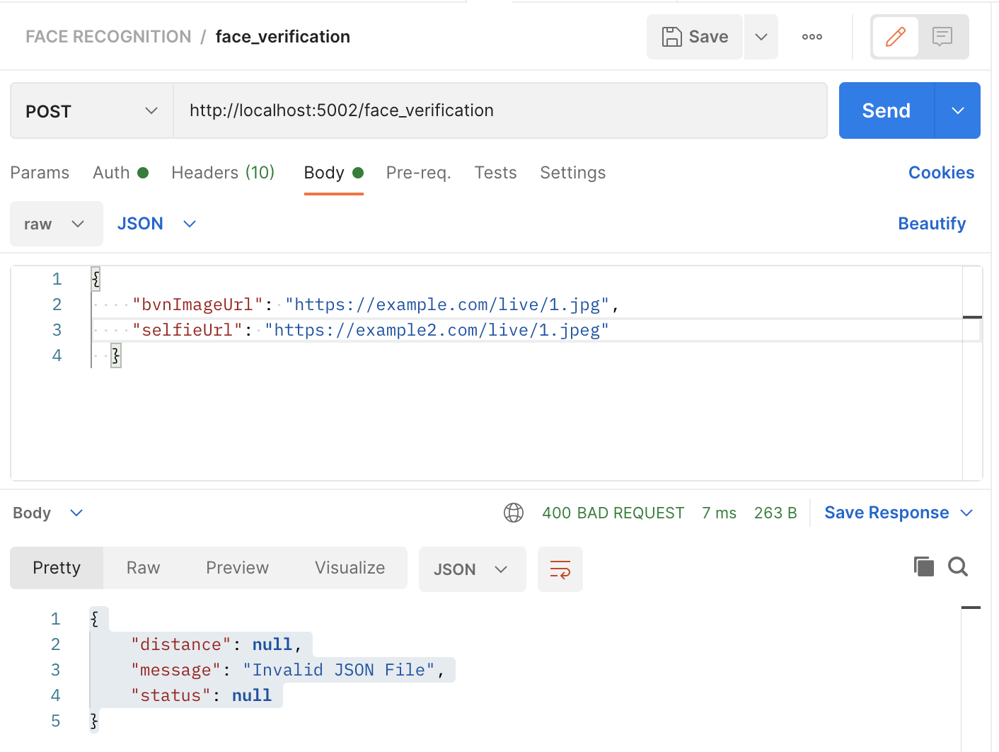

# Face Verification Service
This is Face Verification endpoint to verify images from a Phone Selfie vs BVN

## Usage
All responses will have the form
```
{
    "Name": Name_of_customer,
    "distance": 0.424,
    "verify": boolean value(true/false)
}
```

Subsequent response definitions will only detail the expected value of the `data field`

**API Endpoints:**

* '/' :   return the facial verification documentation
* face_verification : return a Name, Distance, and Verification(true/false) for the bvn & selfie  images


# Installation
Install [face_recognition](https://github.com/ageitgey/face_recognition) together with [dlib](http://dlib.net/) first.

**Then run:** `pip install -r requirements.txt`


## Definition

`Get/face_verification`
## Response
* `200 OK` on success

```
{
    "message": "endpoint is working",
    "status": "success"
}
```

# Getting a Face verified
## Definition
`POST / face_verification`

### Arguments
* url to bvn image
* url to selfie image

## Response
* `201 Created on success`

```
{
    "distance": 0.507,
    "message": "verified successfully",
    "status": false
}

{
    "distance": 0.34,
    "message": "verified successfully",
    "status": true
}

{
    "distance": null,
    "message": "Invalid JSON File",
    "status": null
}
```

# How to Run
## Prerequisites
Prepare some known faces as a database or as a url.

```
# Each face is tuple of (Name,sample image)    
{
    "bvnImageUrl": "https://example.com/live/1.jpg",
    "selfieUrl": "https://example2.com/live/1.jpeg"
  }
```
## Run API Server
python app.py


## Run API client - Postman
Simply open a Postman  and enter:

http://localhost:5002/face_verification


Select `Post Request` and click send.


#### Projects Page
<p align="center"> 
  <kbd>
    <a href="https://github.com/okoliechykwuka/Face-verification-app/" target="_blank">
  </a>
  </kbd>
</p>
